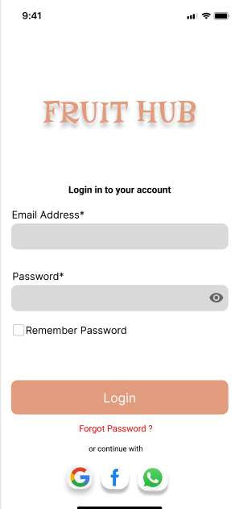
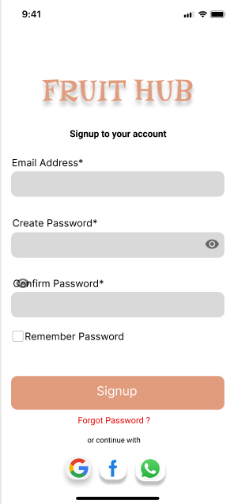
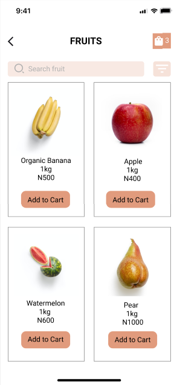
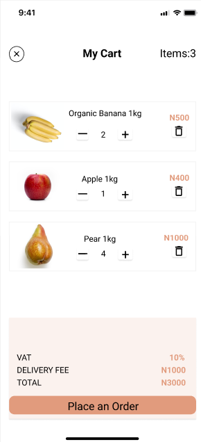
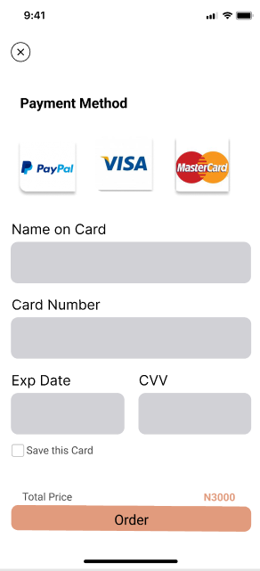
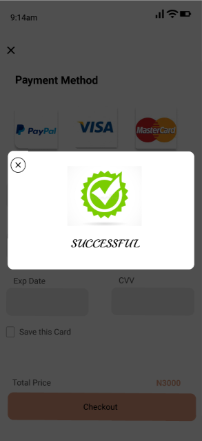

# 🍎 FruitApp – Online Fruit & Vegetable Store API

FruitApp, Java və Spring Boot istifadə edilərək hazırlanmış **E-Commerce API**-dır. Bu tətbiqdə istifadəçilər qeydiyyatdan keçə, giriş edə, məhsullara baxa, səbətə əlavə edə və ödəniş həyata keçirə bilirlər. Bütün əsas biznes prosesləri **JWT Security** ilə qorunur və PostgreSQL verilənlər bazasında saxlanılır.

---

## 🚀 Texnologiyalar
- **Java 17**
- **Spring Boot 3**
- **Spring Security (JWT Authentication & Authorization)**
- **Spring Data JPA (Hibernate)**
- **PostgreSQL**
- **Lombok**
- **Maven**
- **Postman (API testləri üçün)**
- **Mail Sender (OTP ilə parol bərpası üçün)**

---

## 🔐 Authentication & Security
- **SignUp (Qeydiyyat)** – istifadəçi email və şifrə ilə qeydiyyatdan keçir.
- **Login** – uğurlu giriş zamanı **Access Token** və **Refresh Token** yaradılır.
- **Forgot Password** – email-ə OTP göndərilir və OTP vasitəsilə yeni parol təyin edilir.
- **JWT Protection** – bütün endpointlər yalnız **JWT token** ilə qorunur (SignUp, Login, Forgot Password istisna olmaqla).
- **Refresh Token (Remember Me)** – uzunmüddətli oturum üçün refresh token mexanizmi.

---

## 🛒 Funksionallıq
- 👤 İstifadəçi qeydiyyatı və girişi
- 🔑 OTP ilə parol bərpası
- 🍇 Məhsulların siyahısı (meyvələr, tərəvəzlər və s.)
- 📂 Məhsullar **kategoriya**, **valyuta**, **status** və **ölçü vahidi** ilə bağlıdır
- 🛍 Məhsulu səbətə əlavə etmə
- 💳 Səbətdən ödəniş etmə (Kart vasitəsilə)
- 📦 Stok idarəetməsi (məhsul sayının avtomatik azalması)

---

## 📷 Görsellər (Frontend)

🏠 **First Page**  


🔐 **Login Page**  


📝 **SignUp Page**  


🍏 **Products Page**  


🛒 **Cart Page**  


💳 **Payment Page**  



---

## 📬 API Documentation (Postman)

Bütün API endpoint-lər üçün Postman collection əlavə olunub:  
👉 [FruitApp.postman_collection.json](postman/FruitApp.postman_collection.json)

Məsələn:
- `POST /api/v1/signUp` – yeni istifadəçi qeydiyyatı
- `POST /api/v1/login` – giriş və tokenlərin alınması
- `POST /api/v1/forgot-password/request` – OTP göndərilməsi
- `POST /api/v1/forgot-password/verify-otp` – OTP təsdiqi
- `GET /api/v1/fruits/search?keyword=&page=0&size=5` – bütün məhsulların siyahısı
- `POST /api/v1/sebet/fruitId` – məhsulun səbətə əlavə edilməsi
- `POST /api/v1/payment` – ödəniş etmək

---

## ⚙️ Quraşdırma və İşə Salma

```bash
# Repository-i klonla
git clone https://github.com/USERNAME/FruitApp.git
cd FruitApp

# Maven ilə build et
mvn clean install

# PostgreSQL-də database yarat
createdb fruitapp

# application.properties və ya application.yml faylında DB məlumatlarını düzəlt
spring.datasource.url=jdbc:postgresql://localhost:5432/fruitapp
spring.datasource.username=postgres
spring.datasource.password=yourpassword

# Proqramı işə sal
mvn spring-boot:run

